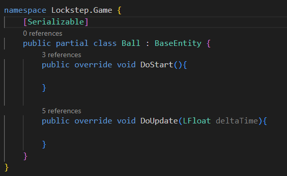
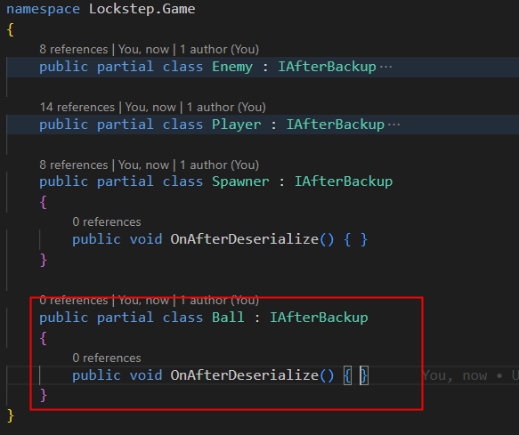
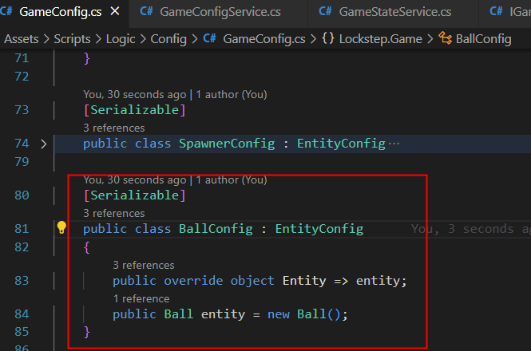
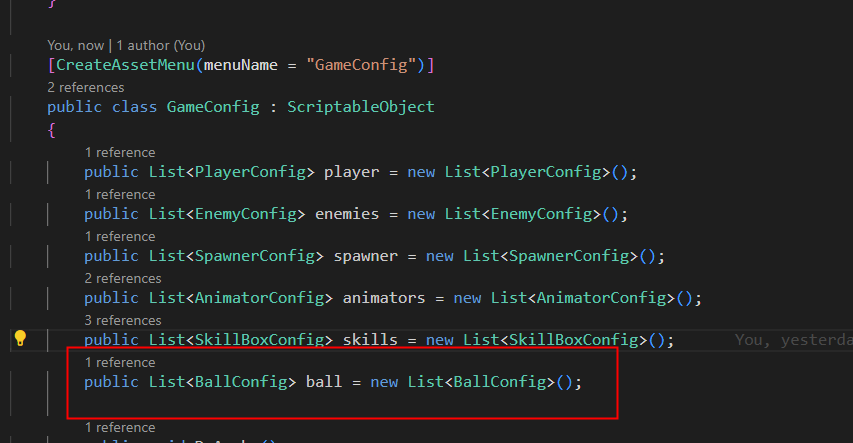
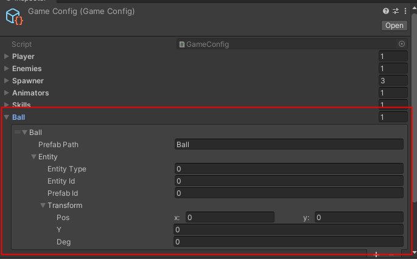

- [DEV\_LIST](#dev_list)
- [Framework Pipeline](#framework-pipeline)
  - [ECS Core](#ecs-core)
    - [How write GameCore Code](#how-write-gamecore-code)
      - [new Entity](#new-entity)
      - [显示层（GameObject绑定Entity）](#显示层gameobject绑定entity)
      - [new ComponentData](#new-componentdata)
      - [new System](#new-system)
    - [Runtime ECS 的增删改查](#runtime-ecs-的增删改查)
      - [创建Entity](#创建entity)
      - [查找Entity](#查找entity)
      - [删除Entity](#删除entity)
      - [修改ComponentData](#修改componentdata)
      - [新增ComponentData](#新增componentdata)
      - [删除ComponentData](#删除componentdata)
- [References](#references)

---

# DEV_LIST

- [X] [HashCode 验证](/Doc/HashCode%20%E9%AA%8C%E8%AF%81.md)
- [X] [弱网络测试](/Doc/%E5%BC%B1%E7%BD%91%E7%BB%9C%E6%B5%8B%E8%AF%95.md)
- [ ] 断线重连流程
- [ ] 本地重播流程
- [ ] Sync 流程图
- [ ] UDP、TCP 环境验证
- [ ] CodeGenerate 生成
- [ ] AssetBundle
- [ ] HybridCLR
- [ ] 一键打包工具
- [ ] 资源规范检测工具
- [ ] 战斗基础流程
  - [ ] 关卡加载
  - [ ] 动画模块接入

- [ ] 战斗验证
  - [ ] 动画帧与逻辑帧号对齐
  - [ ] Timeline 结合 帧同步
  - [ ] 动画驱动位移测试
  - [ ] 验证2D碰撞物理模拟：例如台球（2D）
  - [ ] 

# Framework Pipeline

- 三种模式：
  - Client 模式
  - Host Client 模式
  - Pure Server 模式
- 两个工程：
  - Client 工程
  - Client 工程 + 内嵌战斗服代码（战斗服只是一个网络线程，只做广播协议）
- 工程启动流程：
  - 打开 Launch 场景
    - Host Client 模式：作为房主，点击CreateRoom，创建房间，会得到随机端口号，也可以自主设定端口号；
    - Client 模式：点击 JoinRoom，输入目标端口，进入房间

## ECS Core

### How write GameCore Code

#### new Entity 

新增一种Entity，例如新增一个篮球，加入到玩法中

Entity 文件夹下，新增类：Ball。如下图：

ExtensionAfterBackupEntity文件下补充，如下图：

!最后点击 LPEngine->CodeGen，运行成功后。ExtensionBackup文件内会生成代码，自动填补了Hash、备份等相关代码。

#### 显示层（GameObject绑定Entity）

ECS 属于逻辑层，GameObject 属于显示层。我们需要特别的操作，将显示层绑定特定的Entity

对于需要GameObject显示对象的，需要新增Config。在GameConfig内补充，如下：

另外，GameConfig中也需要设置，如下：

Resources内的配置也需要设置，如下：

#### new ComponentData

新增一种ComponentData

#### new System

新增一种规则、驱动逻辑

### Runtime ECS 的增删改查

#### 创建Entity

#### 查找Entity

#### 删除Entity

#### 修改ComponentData

#### 新增ComponentData

#### 删除ComponentData

---
# References

<https://github.com/JiepengTan/LockstepEngine>
<https://github.com/JiepengTan/LockstepEngine_ARPGDemo>
<https://www.bilibili.com/video/av70422751/>
<https://github.com/JiepengTan/LockstepMath>
<https://github.com/JiepengTan/LockstepCollision>
<https://github.com/JiepengTan/LockstepBehaviorTree>
<https://github.com/JiepengTan/LockstepPathFinding>

